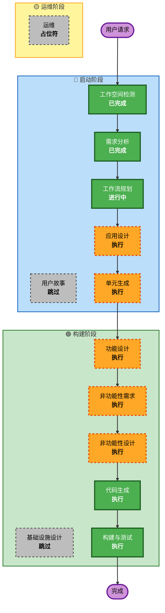

# 执行计划 - Stocks Assist（股票助手）

## 详细分析摘要

### 变更影响评估
- **用户界面变更**: 是 - 全新的前端应用，包含多个页面和交互
- **结构变更**: 是 - 全新的前后端架构
- **数据模型变更**: 是 - 需要设计用户、组合、标的等数据模型
- **API 变更**: 是 - 需要设计完整的 RESTful API
- **非功能性需求影响**: 是 - 性能、安全、响应式设计等

### 风险评估
- **风险等级**: 中等
- **回滚复杂度**: 低（全新项目，无历史包袱）
- **测试复杂度**: 中等（前后端集成、第三方 API 集成）

---

## 工作流可视化



### 文本替代方案

```
启动阶段 (INCEPTION):
  ✅ 工作空间检测 - 已完成
  ✅ 需求分析 - 已完成
  ⏭️ 用户故事 - 跳过
  ✅ 工作流规划 - 进行中
  🔶 应用设计 - 待执行
  🔶 单元生成 - 待执行

构建阶段 (CONSTRUCTION):
  🔶 功能设计 - 待执行
  🔶 非功能性需求 - 待执行
  🔶 非功能性设计 - 待执行
  ⏭️ 基础设施设计 - 跳过
  🟢 代码生成 - 待执行（始终执行）
  🟢 构建与测试 - 待执行（始终执行）

运维阶段 (OPERATIONS):
  ⏭️ 运维 - 占位符
```

---

## 执行阶段详情

### 🔵 启动阶段
- [x] 工作空间检测 (已完成)
- [x] 逆向工程 - 跳过（全新项目）
- [x] 需求分析 (已完成)
- [x] 用户故事 - 跳过
  - **理由**: 项目需求已经非常明确，功能边界清晰，用户角色单一（普通用户），不需要额外的用户故事来澄清需求
- [x] 工作流规划 (进行中)
- [ ] 应用设计 - **执行**
  - **理由**: 全新项目，需要设计前后端组件结构、API 接口、数据模型、组件依赖关系
- [ ] 单元生成 - **执行**
  - **理由**: 项目包含前端和后端两个主要模块，需要分解为多个工作单元以便有序实施

### 🟢 构建阶段
- [ ] 功能设计 - **执行**
  - **理由**: 需要详细设计数据模型、业务逻辑规则、API 请求/响应格式
- [ ] 非功能性需求 - **执行**
  - **理由**: 有明确的性能要求（< 1秒加载）、安全需求（JWT、2FA、验证码）、响应式设计需求
- [ ] 非功能性设计 - **执行**
  - **理由**: 需要设计安全架构（JWT 流程、2FA 流程）、性能优化方案、主题切换机制
- [ ] 基础设施设计 - **跳过**
  - **理由**: 仅本地开发运行，不需要云基础设施或部署架构设计
- [ ] 代码生成 - **执行**（始终执行）
  - **理由**: 需要生成完整的前后端代码
- [ ] 构建与测试 - **执行**（始终执行）
  - **理由**: 需要提供构建指南和测试方案

### 🟡 运维阶段
- [ ] 运维 - 占位符
  - **理由**: 未来扩展，当前不需要

---

## 预计工作单元

基于项目分析，预计将分解为以下工作单元：

### 单元 1: 后端基础架构
- FastAPI 项目搭建
- 数据库模型设计（SQLAlchemy + SQLite）
- JWT 认证系统
- 用户注册/登录 API

### 单元 2: 后端业务功能
- 2FA (TOTP) 实现
- 自选组合 CRUD API
- 自选标的 CRUD API
- Tushare 行情数据集成

### 单元 3: 前端基础架构
- React + TypeScript + Vite 项目搭建
- Ant Design 主题配置（深色/浅色）
- 路由配置
- Zustand 状态管理
- Axios HTTP 客户端封装

### 单元 4: 前端业务功能
- 用户注册/登录页面
- 滑块验证码组件
- 2FA 设置和验证页面
- 行情榜单页面
- 标的搜索组件
- 自选组合管理页面
- 自选标的管理页面
- 个人中心页面

---

## 预计时间线
- **总阶段数**: 8 个阶段（3 已完成，5 待执行）
- **预计工作单元**: 4 个
- **预计交互轮次**: 每个阶段 1-2 轮审批

## 成功标准
- **主要目标**: 完成一个可运行的全栈股票自选管理应用
- **关键交付物**:
  - 完整的前端 React 应用
  - 完整的后端 FastAPI 应用
  - SQLite 数据库及初始数据
  - 单元测试和集成测试
  - 项目文档（README、API 文档）
- **质量门槛**:
  - 页面加载时间 < 1 秒
  - 测试覆盖率 80%+
  - 代码通过 ESLint 检查
  - 响应式设计适配桌面和移动端
